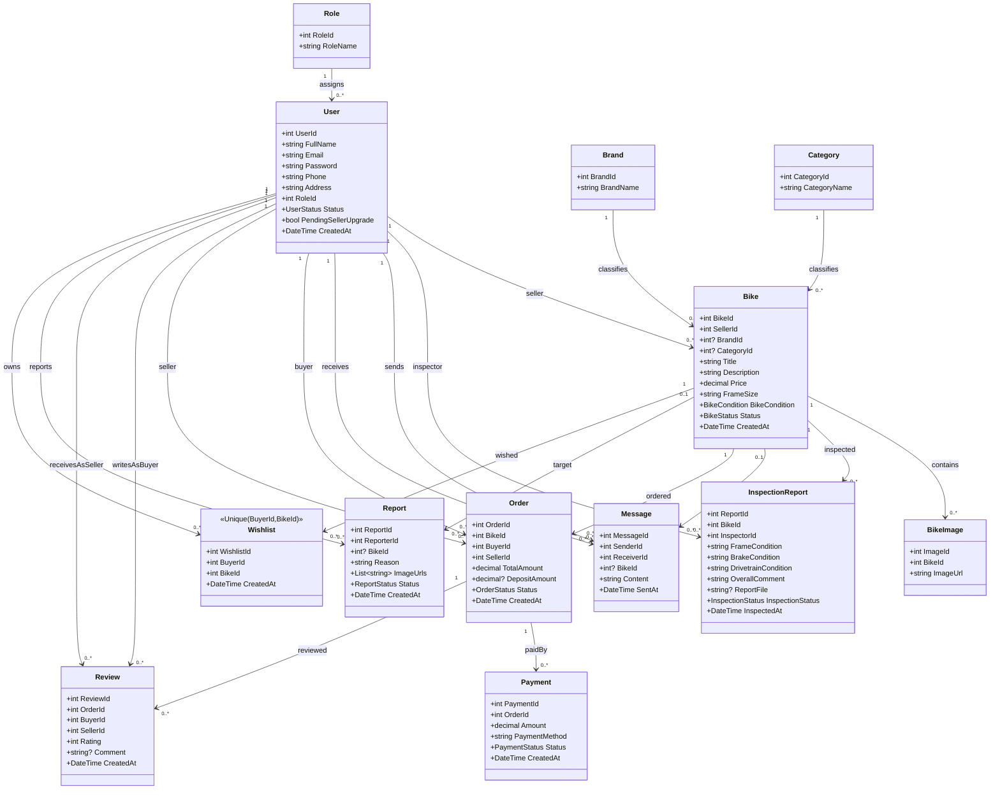

# CycleTrust - UML Class Diagram

## 1) Domain Model (Core Business Classes)

## 2) Application Layer (Clean Layered Structure)

```mermaid
classDiagram
    class CycleTrustDbContext {
        +DbSet~User~ Users
        +DbSet~Role~ Roles
        +DbSet~Bike~ Bikes
        +DbSet~BikeImage~ BikeImages
        +DbSet~Brand~ Brands
        +DbSet~Category~ Categories
        +DbSet~InspectionReport~ InspectionReports
        +DbSet~Message~ Messages
        +DbSet~Order~ Orders
        +DbSet~Payment~ Payments
        +DbSet~Report~ Reports
        +DbSet~Review~ Reviews
        +DbSet~Wishlist~ Wishlists
        #OnModelCreating(modelBuilder)
    }

    class IBikeService
    class IOrderService
    class IUserService
    class IMessageService
    class IPaymentService
    class IReviewService
    class IReportService
    class IWishlistService
    class IInspectionReportService
    class IBikeImageService
    class IBrandService
    class ICategoryService
    class IRoleService
    class ICloudinaryService

    class BikeService
    class OrderService
    class UserService
    class MessageService
    class PaymentService
    class ReviewService
    class ReportService
    class WishlistService
    class InspectionReportService
    class BikeImageService
    class BrandService
    class CategoryService
    class RoleService
    class CloudinaryService

    class BikesController
    class OrdersController
    class UsersController
    class MessagesController
    class PaymentController
    class ReviewsController
    class ReportsController
    class WishlistsController
    class InspectionReportsController
    class BikeImagesController
    class BrandsController
    class CategoriesController
    class RolesController
    class AuthController

    IBikeService <|.. BikeService
    IOrderService <|.. OrderService
    IUserService <|.. UserService
    IMessageService <|.. MessageService
    IPaymentService <|.. PaymentService
    IReviewService <|.. ReviewService
    IReportService <|.. ReportService
    IWishlistService <|.. WishlistService
    IInspectionReportService <|.. InspectionReportService
    IBikeImageService <|.. BikeImageService
    IBrandService <|.. BrandService
    ICategoryService <|.. CategoryService
    IRoleService <|.. RoleService
    ICloudinaryService <|.. CloudinaryService

    BikesController --> IBikeService
    BikesController --> ICloudinaryService
    BikesController --> IBikeImageService
    BikesController --> IInspectionReportService

    OrdersController --> IOrderService
    UsersController --> IUserService
    MessagesController --> IMessageService
    PaymentController --> IPaymentService
    ReviewsController --> IReviewService
    ReportsController --> IReportService
    WishlistsController --> IWishlistService
    InspectionReportsController --> IInspectionReportService
    BikeImagesController --> IBikeImageService
    BrandsController --> IBrandService
    CategoriesController --> ICategoryService
    RolesController --> IRoleService

    BikeService --> CycleTrustDbContext
    OrderService --> CycleTrustDbContext
    UserService --> CycleTrustDbContext
    MessageService --> CycleTrustDbContext
    PaymentService --> CycleTrustDbContext
    ReviewService --> CycleTrustDbContext
    ReportService --> CycleTrustDbContext
    WishlistService --> CycleTrustDbContext
    InspectionReportService --> CycleTrustDbContext
    BikeImageService --> CycleTrustDbContext
    BrandService --> CycleTrustDbContext
    CategoryService --> CycleTrustDbContext
    RoleService --> CycleTrustDbContext
```

## 3) Notes for System Architecture Report

- Architecture style: Layered Architecture (WebAPI -> BLL Service/Interface -> DAL DbContext/Entity).
- Persistence: Entity Framework Core + PostgreSQL.
- Constraint highlights: unique Email, BrandName, CategoryName, RoleName, and Wishlist(BuyerId, BikeId).
- Delete strategies in model: Restrict, Cascade, SetNull (configured in DbContext).
- Security boundary: Role-based authorization at controller level (ADMIN/BUYER/SELLER/INSPECTOR).
